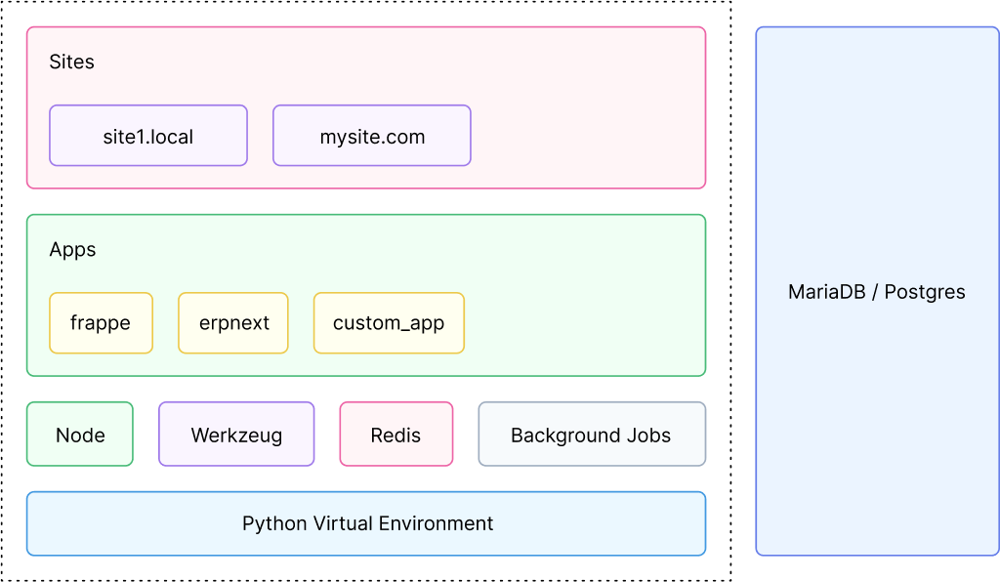
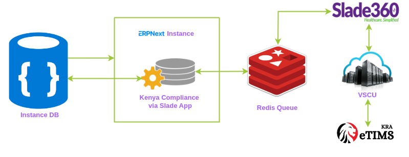
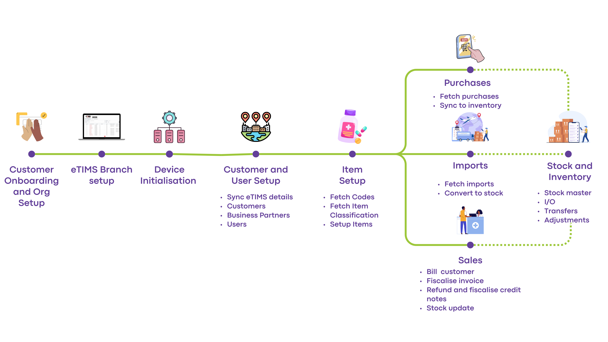

# Architectural Overview

## ERPNext Architecture

## ERPNext & eTims Communication

## Customer Journey to Tax Compliance

Once installed and configured, ERPNext communicates with eTims servers via background jobs executed by [Redis Queue](https://redis.com/glossary/redis-queue/).

[<< Previous: Home](/README.md) | [Next: Setup Configuration >>](/kenya_compliance_via_slade/docs/setup_configuration.md)
