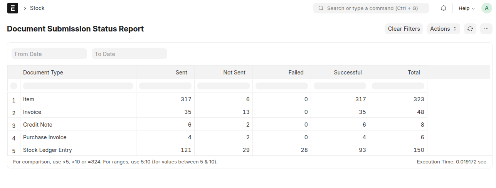
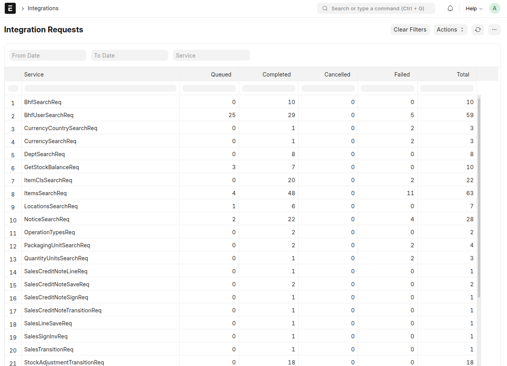
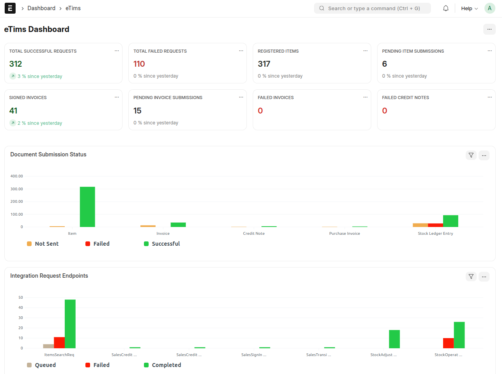

# Dashboard & Reports

This section provides an overview of key reports and dashboards, offering insights into document submissions, request tracking, and real-time eTims integration.

---

## 📊 **Submission Report**

The **Submission Report** offers a comprehensive view of all critical documents sent to eTims. It helps track submission status and ensures compliance with regulatory requirements.

### Key Documents Tracked:

- **Sales Invoice** – Monitor successful submissions and track any pending or failed invoices.
- **Item** – Ensure items are registered correctly with eTims and validate their compliance.
- **Purchase Invoice** – Keep records of all supplier invoices and ensure they align with eTims regulations.
- **Stock Ledger Entry (SLE)** – Track inventory movements and ensure real-time updates to eTims.

✅ **Features:**

- View submission statuses: Pending, Successful, Failed.
- Detailed logs for each document type.
- Identify errors and correct submission failures.

---

## 🔍 **Request Tracking Report**

The **Request Tracking Report** tracks all integrations through the Integration Request doctype, providing a detailed report of each API URL by route key. It monitors the different statuses for each request.

### What It Tracks:

- **API Requests** – Logs every submission sent to eTims.
- **Responses** – Tracks eTims responses and statuses.
- **Error Handling** – Identifies failed requests and highlights areas requiring attention.

✅ **Features:**

- Real-time tracking of all eTims communication.
- Detailed request-response logs for auditing.
- Instant identification of failed or incomplete transactions.

---

## 📈 **eTims Dashboard**

The **eTims Dashboard** provides a real-time overview of all eTims-related activities, helping you manage compliance and track submissions efficiently.

### Dashboard Insights:

#### 📌 **Key Metrics & Cards:**

- **Total Successful Requests** – Displays the total number of successfully processed requests.
- **Total Failed Requests** – Tracks all failed eTims submissions.
- **Registered Items** – Shows the number of successfully registered items in eTims.
- **Pending Item Submissions** – Lists items that are yet to be submitted.
- **Signed Invoices** – Indicates the total number of invoices successfully signed and submitted.
- **Pending Invoice Submissions** – Highlights invoices waiting for submission.
- **Failed Invoices** – Tracks invoices that failed during submission.
- **Failed Credit Notes** – Displays credit notes that were not successfully processed.

#### 📊 **Charts & Visual Insights:**

- **Document Submission Status** – Provides a full-width graphical representation of submission statuses (Pending, Successful, Failed).
- **Integration Request Endpoints** – Displays a full-width chart summarizing API requests, endpoints, and responses.

✅ **Features:**

- Visual summary of submission statuses.
- Quick access to detailed records and logs.
- Efficient troubleshooting with error reporting.

---

[⬅️ Previous: Customisations](./customisations.md)
