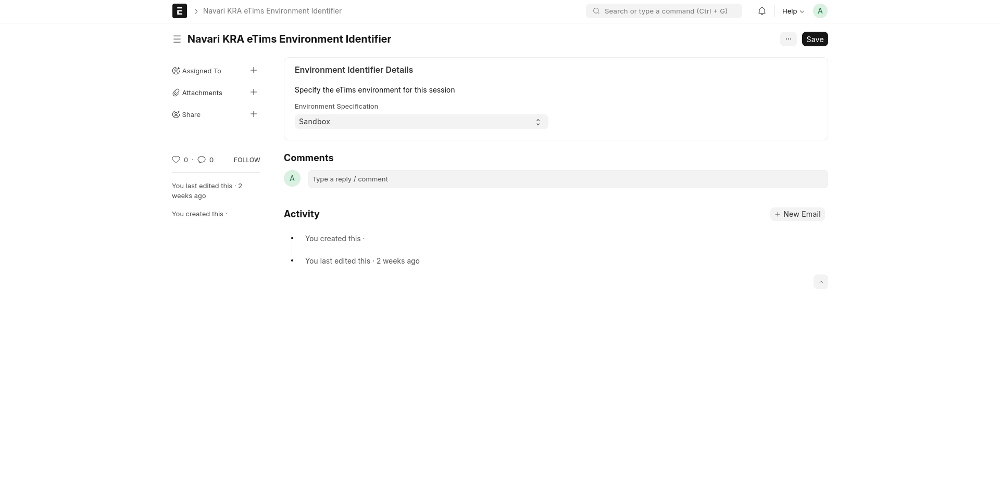

### Current Environment Identifier

This doctype is used to provide a global identifier for the current environment, which will in turn influence whether communication will happen with the Sandbox or Production eTims servers that KRA has provided.

This is a Single doctype with only two possible values: _Sandbox or Production_.

**NOTE**: The option is applied globally to all users of the current ERPNext instance.

