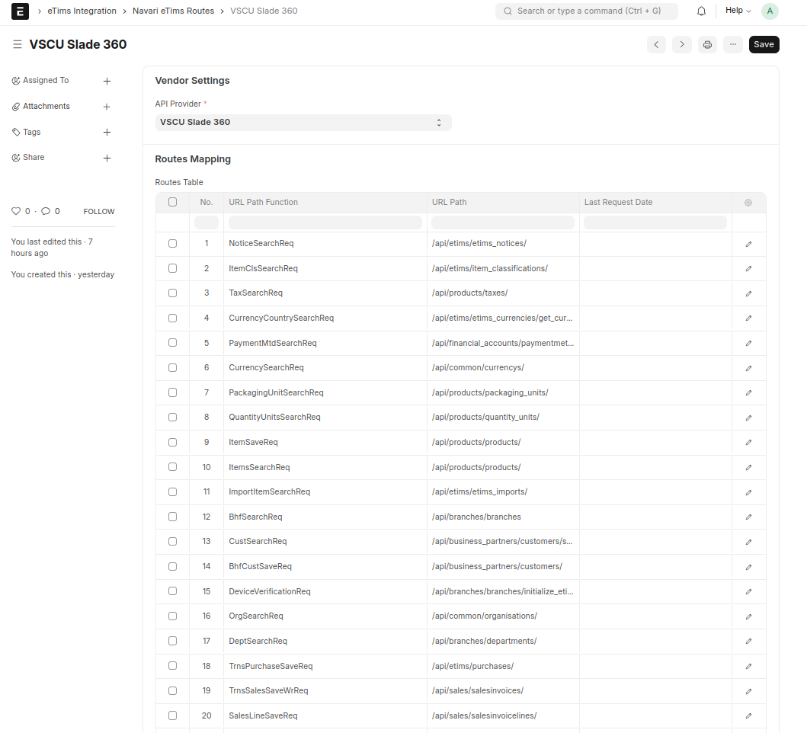

### 🚦 Routes Reference

This doctype holds references to the endpoints provided by KRA for various activities. Each endpoint has an associated last request date that is updated after each eTims response. For comprehensive documentation on the various endpoints, see the [More Details](#etims_official_documentation) section at the beginning.

> **Note**: The _URL Path Function_ field is used as the search parameter whenever an endpoint is retrieved.
