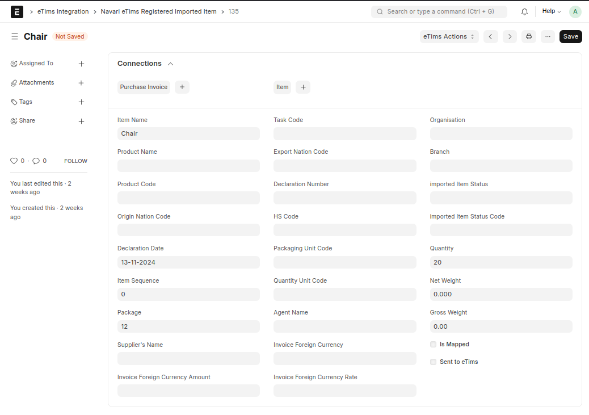
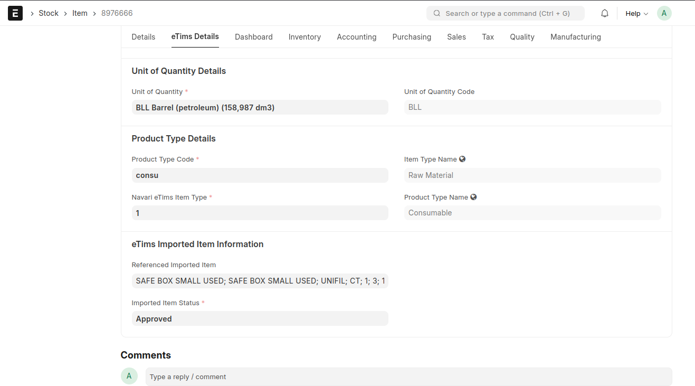

### Imported Item Management

The **Registered Imported Item** doctype allows one to fetch imported items declared to belong to the user's company. These Items can be of existing Items (items already in ERPNext's database) or new Items.

To link an Imported Item to an existing Item, you reference the Item in the _Referenced Imported Item_ field of Item doctype under the _Purchasing_ tab.

Once the records have been linked, the user can submit the _converted_ (specifying the item classification of the accepted imported item) back to eTims to register the item. This is done through the _eTims Action, Submit Imported Item_ action button. This action button is active if the Item is linked to an Imported Item and the Item has not been registered prior.
