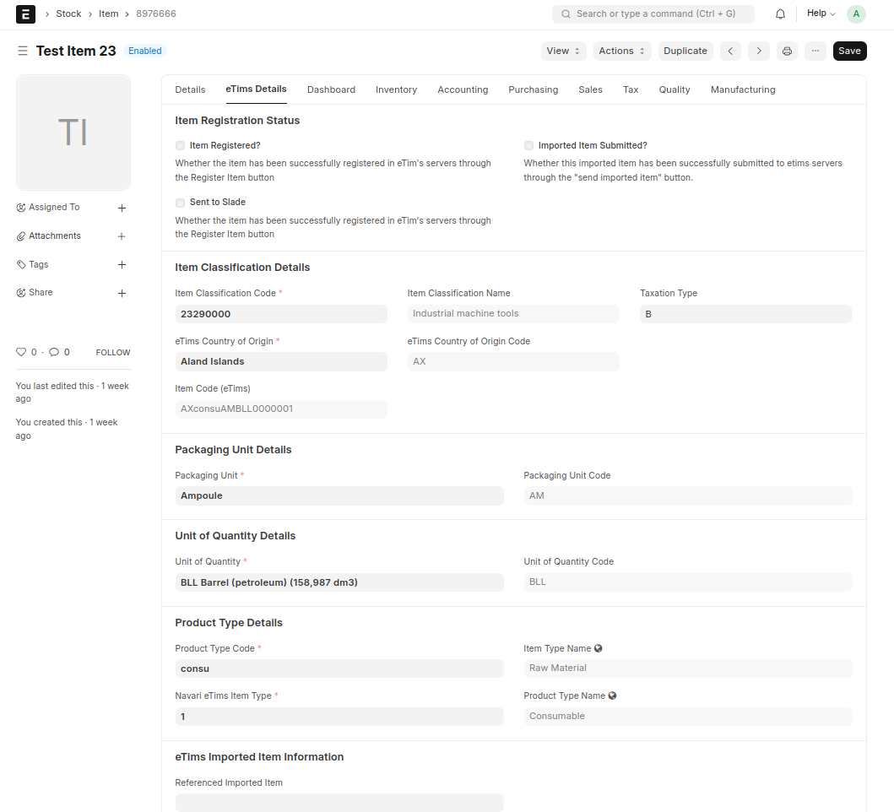
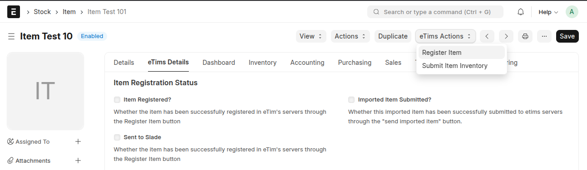
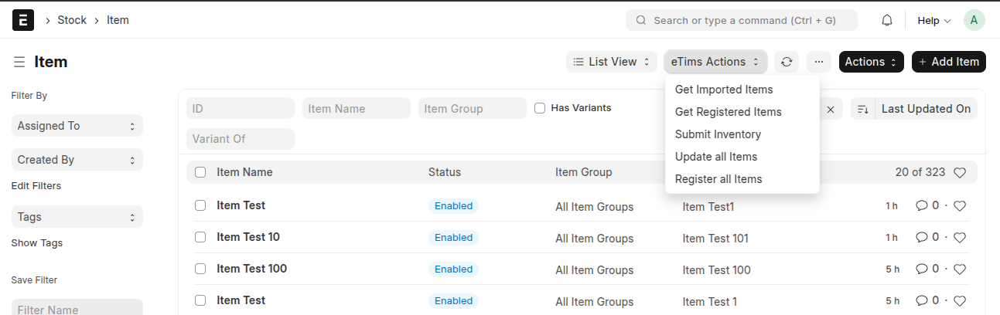

## Item Customisations

### eTims Details Tab

The **eTims Details tab** will be present for each item during and after loading. The tab holds fields to various doctypes that allow one to classify each item according to the specifications provided by KRA.

**NOTE**: The information captured here is mandatory when sending sales information to the eTims servers.

#### Linked Doctypes

1. **Item Classifications**: Item classifications as specified by KRA.
2. **Packaging Unit**: Packaging units as specified by KRA, e.g. Jars, wooden box, etc.
3. **Unit of Quantity**: Units of Quantity as specified by KRA, e.g. kilo-gramme, grammes, etc.
4. **Product Type**: Product type as specified by KRA, e.g. finished product, raw materials, etc.
5. **Item Type**: Product type as specified by KRA, e.g. sku, consu, service, etc.
6. **Country of Origin**: The country of origin declared for the item.

### Item Registration

Items are submitted on update or creation if the relevant settings are enabled and all required fields are filled. Additionally, items can be sent using the _Register Item_ button under eTims actions.

#### Registration Process

1. **On Registration**:
   - Creates an `ItemSaveReq` integration request.
   - Gets back the Slade ID.
2. **Bulk Submission**:
   - Queues the item registration through _Bulk Register Items_ or _Submit All Items_.
3. **After Submitting an Item**:
   - Inventory is submitted using an `Inventory Adjustment Request - StockMasterSaveReq`.
   - Options to _Submit All Inventory_ in item list and _Submit Inventory_ under eTims actions for each item.
