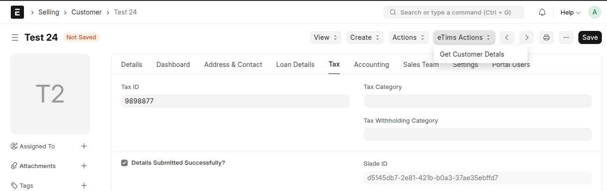
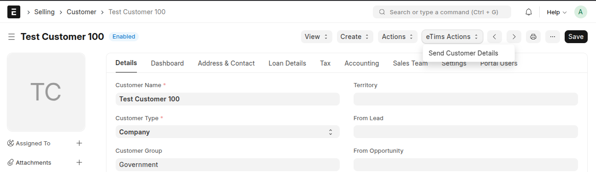
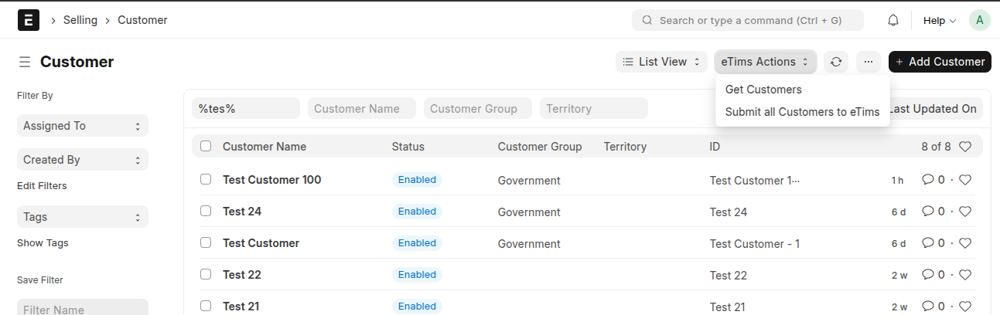

## Customer and Supplier Management

### eTims Details Tab

The **Tax tab** is available for each customer and supplier both during and after loading. This tab contains fields to track eTims registration. No additional data needs to be captured.

### Customer and Supplier Registration

Customers and suppliers are submitted on update or creation if the relevant settings are enabled. Additionally, they can be sent using the _Send Customer Details_ or _Send Supplier Details_ button under eTims actions.

#### Registration Process

1. **On Registration**:
   - Creates a `BhfCustSaveReq` integration request.
   - Gets back the Slade ID.
2. **After Submitting an Entity**:
   - The entity is updated with the received Slade ID for future reference.
3. **Bulk Submission**:
   - Queues the customer or supplier registration through _Submit all Customers to eTims_ or _Submit all Suppliers to eTims_ in customer or supplier list.

This process ensures seamless tax compliance and integration with the eTims system, maintaining accurate customer and supplier records in line with KRA requirements.
