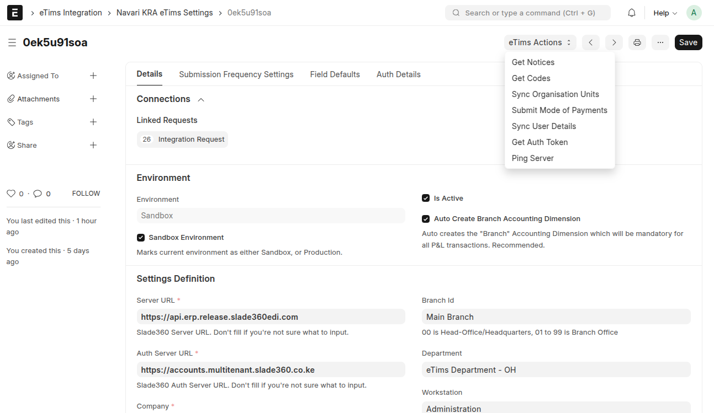

## Setup and Configuration

To set up the application, follow these steps:

1. **Create the eTims Settings**:

   Navigate to the eTims Settings doctype and create a new record with the necessary details. [Learn more](settings_configuration.md)

2. **Fetch All Codes**:

   In the eTims Settings doctype, click the _Get Codes_ button to fetch the latest codes from the eTims servers. [Learn more](settings_configuration.md)

3. **Sync the Organisation Structures**:

   In the eTims Settings doctype, click the _Sync Organisation Units_ button to synchronize the organization structure, including branches, company, departments, and workstations.

4. **Submit All Mode of Payments**:

   In the eTims Settings doctype, click the _Submit Mode of Payments_ button to set up the modes of payments.

5. **Submit All Customers and Suppliers**:

   Navigate to the Customer and Supplier list views and click the _Submit Customers_ and _Submit Suppliers_ buttons to submit all customer and supplier details.

6. **Classify and Register All Items**:

   Navigate to the Item list view and classify each item according to the specifications provided by KRA and submit to eTims. [Learn more](item_actions.md)

By following these steps, you will ensure that your application is properly set up and ready to communicate with the eTims servers.

[<< Previous: Architectural Overview](architecture.md) | [Next: Key Features >>](./features.md)
